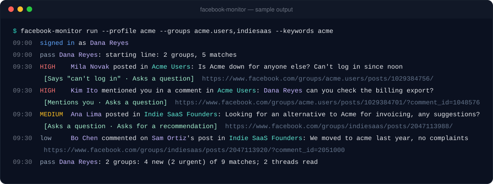
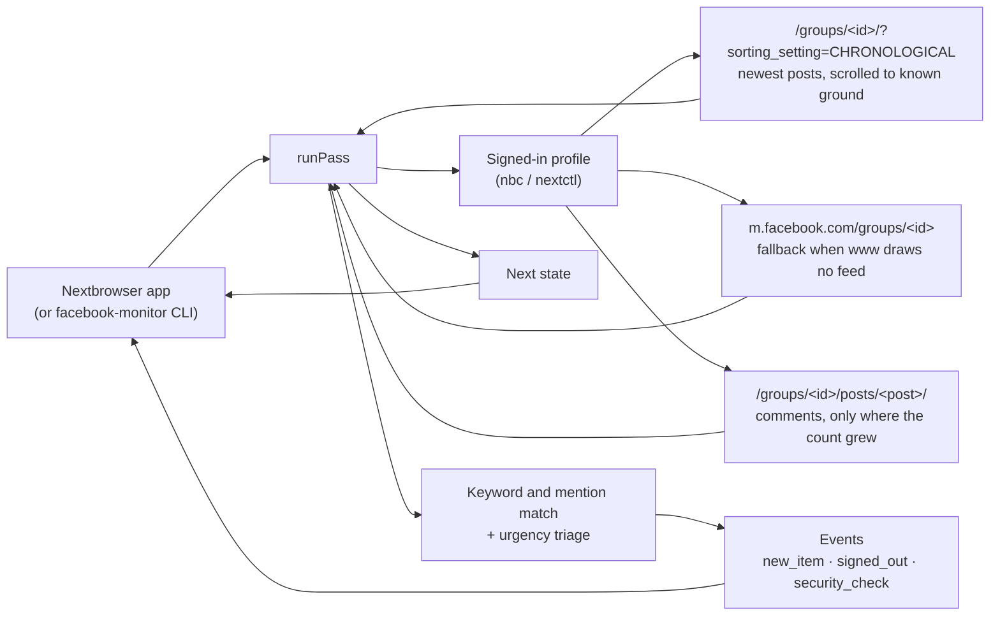

<p align="center">
  
</p>

<h1 align="center">Nextbrowser Facebook Monitoring</h1>

<p align="center">
  <strong>The open-source Facebook Groups monitoring engine for Nextbrowser: posts and comments in the groups you watch that name your keywords or mention you, each with its group and post, ranked by how urgently they need an answer, read from your own signed-in browser profile.</strong>
</p>

<p align="center">
  <a href="https://nextbrowser.com/">Website</a> ·
  <a href="https://github.com/nextbrowser-oss/nextbrowser-app">Nextbrowser app</a> ·
  <a href="https://docs.nextbrowser.com/">Product docs</a> ·
  <a href="docs/walkthrough.md">Walkthrough</a> ·
  <a href="docs/how-it-works.md">How it works</a> ·
  <a href="https://discord.com/invite/gHXEvkGXnz">Discord</a>
</p>

<p align="center">
  <a href="https://github.com/nextbrowser-oss/nextbrowser-facebook-monitoring/actions/workflows/ci.yml"></a>
  <a href="LICENSE"></a>
  
  
  <a href="https://github.com/nextbrowser-oss/nextbrowser-app"></a>
</p>

<p align="center">
  English ·
  <a href="docs/i18n/ru/README.md">Русский</a>
</p>

<p align="center">
  
</p>

## Why Nextbrowser Facebook Monitoring

This package is the engine behind Facebook Groups monitoring in [Nextbrowser](https://github.com/nextbrowser-oss/nextbrowser-app). The conversations that matter about a product often happen in Facebook groups — user groups, founder circles, local buy-and-sell groups — and a group's content is gated: it is shown only to a signed-in member, and no ordinary API or search tool can read it. The engine runs on a browser profile you have signed in to facebook.com as a member of those groups, and on every pass it answers three questions:

- which new posts in the watched groups name your keywords — a brand, a product, a competitor;
- who mentioned you, and who commented on your own posts or on the posts that concern you;
- which of all that needs an answer first.

It is open source because it works with your own account. Anyone can read exactly which pages it opens, what it reads from them, and how it decides what is urgent.

- **Read-only.** It never reacts, comments, replies, joins or posts. It does not even click "See more": a post cut short is reported as cut short.
- **Context in every alert.** Each item carries its group (id, name, link), its post (id, link, author, opening text), and for a comment the post it is under.
- **No duplicate alerts.** Every post and comment is remembered by its id, so an item is announced once, ever, across restarts.
- **Explainable triage.** Fixed rules rank every match *high*, *medium* or *low*, and each match carries the reasons in plain words. No model is involved and nothing leaves the machine.
- **Says what went wrong.** A signed-out profile, a security check, a temporary block, a group you are not a member of, and a page Facebook would not draw are reported as what they are, not as "nothing new".

## From a post to an approved reply

Monitoring is one half of the Facebook skill in Nextbrowser. The skill's panel switches between **Monitoring** and **Reply agent**:

| Step | Where | What happens |
| --- | --- | --- |
| 1. Detect mentions and content | this engine | Each watched group's newest posts, newest first, down to where the last pass stopped: the posts that name your keywords or mention you, and the comments under your own posts and under the posts that concern you. |
| 2. Triage by urgency | this engine | Each match is ranked: it mentions you, it is on your post, it says an urgent term such as "refund" or "not working", it asks a question, it asks for a recommendation, nobody has commented yet, it is picking up fast. |
| 3. Draft a response | Nextbrowser's Facebook reply agent | *Draft reply* hands the match — with its group and post — to the connected agent, which opens the post in the same profile, reads the thread and writes an answer to that specific post or comment. |
| 4. Approve before publishing | Nextbrowser's Facebook reply agent | The draft is shown to you first. Nothing is posted until you approve it, and then only that reply. |

The engine stops at step 2 on purpose: whatever it finds, a person decides what gets said. The [walkthrough](docs/walkthrough.md) follows one group post through all four steps.

## Key features

| Area | What is available |
| --- | --- |
| Watched groups | Up to 10 groups, by link, id or vanity name. Each is read chronologically (`?sorting_setting=CHRONOLOGICAL`), newest first, scrolled a few times until it is back at posts the last pass saw. |
| Keywords | Up to 20 words or phrases, matched as whole words in any script. A hashtag counts as a word. Exclusion words drop the noise. With no keywords, only mentions and comments on your posts are reported — or every new post, with `reportAllPosts`. |
| Mentions | A tag that links to the account's profile, or the account's full name in the text. |
| Comments | Under your own posts and under posts that name a keyword or mention you, read only when the post's comment count grew, a few posts per pass. |
| Urgency triage | *high*, *medium* or *low*, with the reasons, from rules you can read in [`src/triage.ts`](src/triage.ts). Urgent terms count only in items about you; a request for a recommendation is a lead, not an emergency. |
| Links and context | Every item links straight to the post (`/groups/<group>/posts/<id>/`) or the comment (`?comment_id=<id>`), and carries the group and the post it belongs to. |
| Fallback | When www.facebook.com draws no feed, the group is read once more from m.facebook.com's simpler, server-drawn page. |
| Persistent state | One JSON document: each group's starting line, seen items, per-post comment counts, the account. Nothing is announced twice across restarts. |
| Degraded states | Signed out, security check, temporarily blocked, not a member, group not available, nothing drawn on either site: each one a clear note and a summary flag. |
| Embeddable core | `runPass(state) → { state, events, summary, matches }`, with no Node dependency, so it runs in the Nextbrowser renderer. |
| Standalone CLI | `facebook-monitor` drives any Nextbrowser profile through `nbc`/`nextctl`. |

## Setup

### In Nextbrowser

1. Open **Skills → Facebook → Monitoring**.
2. Choose a browser profile and press **Open facebook.com**. Sign in there yourself, with an account that is a member of the groups you want to watch; the panel shows `Dana Reyes · Signed in`.
3. Paste the group links (up to 10), add your keywords (brand, product names, common misspellings) and words to skip.
4. Pick an interval — 30 minutes is the default, 15 the minimum — and press **Start**.

The first pass draws each group's starting line and announces nothing; from the second pass on, the panel lists what needs a look, most urgent first, with the group and the post beside each match and *Draft reply* on every one.

Use a profile with its own steady proxy, and an account that already uses those groups like a person does. Facebook blocks accounts that load pages like a script; keep the pacing as it is.

### In code

Nextbrowser ships the engine as a dependency and gives it the browser, a place to keep the state, and a timer:

```ts
import { normalizeState, runPass, scheduleDelay, withSettings } from "@nextbrowser-oss/facebook-monitoring";

const saved = withSettings(normalizeState(await load()), {
  groups: ["https://www.facebook.com/groups/acme.users/"],
  keywords: ["acme"],
});
const { state, events, summary, matches } = await runPass({
  browser: cliBrowser(profileArgs),          // the app's nextctl-backed browser for the profile
  state: saved,
  onEvent: (event) => notify(event),         // new_item, signed_out, security_check, ...
});
await save(state);
show(matches);                               // most urgent first, with the reasons and the group
const backOff = !!summary.blocked || summary.rateLimited || summary.securityCheck || summary.loginRequired;
setTimeout(next, scheduleDelay(30 * 60_000, { backOff }));
```

The [integration guide](docs/integration.md) describes the contract between the app and the engine.

### Standalone

You need Node.js 22 or later and a Nextbrowser profile signed in to facebook.com as a member of the groups. The CLI uses the `nextctl` binary managed by the app, or `nbc` from your `PATH`.

```bash
git clone https://github.com/nextbrowser-oss/nextbrowser-facebook-monitoring.git
cd nextbrowser-facebook-monitoring
npm ci
npm run build
node dist/node/bin.js run --profile <your-profile> --groups <group-link-1>,<group-link-2> --keywords "<brand>,<product name>"
```

What to expect:

1. The first pass records each group's newest posts as its starting line and announces nothing.
2. Each later pass prints new matches, most urgent marked `HIGH`, with the group, the reasons and a direct link, then waits about thirty minutes (`--interval`).
3. Stop it with <kbd>Ctrl</kbd>+<kbd>C</kbd>. The next run continues from the saved state in `~/.nextbrowser/facebook-monitoring/<profile>.json`.

Piped to another program, the output switches to JSON lines, one event per line. The [CLI reference](docs/cli-reference.md) lists every flag.

## Configuration

| Setting | Default | Meaning |
| --- | --- | --- |
| `groups` | `[]` | Up to 10 groups: links, ids or vanity names. |
| `keywords` | `[]` | Up to 20 words or phrases. |
| `excludeKeywords` | `[]` | Words that drop an item even when a keyword matched. |
| `urgentTerms` | a built-in list | Terms that make an item urgent. |
| `reportAllPosts` | `false` | Report every new post in the groups, not only those that name a keyword or mention you. |
| `watchComments` | `true` | Read the comments under your own posts and under posts that concern you, when their count grew. |
| `maxScrolls` | `3` | Scrolls per group to get back to posts the last pass saw (0–6). |
| `maxCommentReads` | `5` | Posts one pass may open for their comments (0–10); the rest wait for the next pass. |
| `maxItemAgeMs` | 72 h | Older items are not announced. |
| `parkTab` | `true` | Leave the tab on `about:blank` after a pass. |

[Events and state](docs/events-and-state.md) describes every setting, event and field of the state document.

## How it works



Every pass, for each watched group in turn: it opens the group's chronological feed, waits until Facebook has drawn it, and reads who is signed in; reads the posts through the page's roles, attributes and link shapes, scrolling back to posts it saw before; falls back to m.facebook.com when nothing was drawn; decides what is new by post id and feed position; opens the posts whose comments are due; and, at the end, parks the tab. The [how it works](docs/how-it-works.md) page explains every rule.

## Documentation

- [Walkthrough](docs/walkthrough.md): one group post from detection to an approved reply, step by step.
- [How it works](docs/how-it-works.md): the pass, reading the page, freshness without timestamps, comments, triage, the fallback, degraded states, pacing.
- [Integration guide](docs/integration.md): the contract with the Nextbrowser app, the Node adapter, installing the package.
- [Events and state](docs/events-and-state.md): every event, the state document, and the settings.
- [CLI reference](docs/cli-reference.md): `facebook-monitor` commands, flags, output, and exit codes.
- [Troubleshooting](docs/troubleshooting.md): signed out, security checks, temporary blocks, not a member, groups that will not draw, missing posts and comments.

## Project status

This is an early release (`0.x`). Known limits:

- **Not yet verified live.** Nothing here has been run against a live signed-in Facebook session. The page scripts are tested against trimmed documents that follow the structure Facebook is known to draw, and the first live run will likely need fixes.
- **Facebook's markup is obfuscated and changes often.** Class names are generated and change with every release, so the scripts never use them: they rely on roles (`[role="feed"]`, `[role="article"]`), aria attributes, attributes Facebook sets for its own reasons (`data-ad-preview="message"`, `dir="auto"`), and the shapes of links (permalinks, profiles, `comment_id`). When Facebook changes those, a read comes back empty, and the pass says so rather than going quiet.
- **Drawn times are not trusted.** Facebook draws times as "3h" or "Yesterday", often scrambled across hidden spans. A post's freshness is decided by its id and its place in the chronological feed; a readable time is only a bound.
- **English UI preferred.** The sign-in, security-check, block and not-a-member screens, and the "Comment by" label on comments, are recognized by their English wording. Posts are read in any language; those states are reported less precisely in others.
- **Comments as drawn.** A post's page shows a selection of its comments ("Most relevant"), not necessarily all of the newest, and the monitor never clicks to change it; replies to comments are not read. The recorded comment count moves only by what a read drew, so a post is reopened up to three times before missing comments are given up on.
- **One post, two ids.** www.facebook.com may link a post by a `pfbid…` id where m.facebook.com uses its number. When a post links both, they are tied together; when not, a fallback read may announce the post a second time.
- **The m.facebook.com fallback may not draw either.** Facebook serves the server-drawn mobile site less and less; when it serves an app shell instead, the group is noted as unreadable for that pass.

Proposals and bugs go to [GitHub Issues](https://github.com/nextbrowser-oss/nextbrowser-facebook-monitoring/issues). An issue is a proposal, not a release commitment.

## Contributing

Read [CONTRIBUTING.md](CONTRIBUTING.md) before opening a change. Keep changes focused. For any change to what is read from facebook.com, or to how a match is ranked, include tests. A README change must also update the [Russian edition](docs/i18n/ru/README.md).

## Community and support

- Join the [Nextbrowser Discord](https://discord.com/invite/gHXEvkGXnz) for community chat, setup help, and product updates.
- Ask general questions in [Nextbrowser Discussions](https://github.com/nextbrowser-oss/nextbrowser-app/discussions).
- Use [GitHub Issues](https://github.com/nextbrowser-oss/nextbrowser-facebook-monitoring/issues) for actionable, scoped work.
- Follow [SECURITY.md](SECURITY.md) for private vulnerability reporting. Do not publish security details in an issue.

## Responsible use

Watch only groups your account is a member of and that you are allowed to monitor — groups you run, or groups whose admins and rules permit it. Follow [Facebook's Terms of Service](https://www.facebook.com/terms.php), its [Automated Data Collection Terms](https://www.facebook.com/apps/site_scraping_tos_terms.php), and each group's own rules: reading through your own browser profile is still automated access, and it is yours to make sure you have the right to it. Keep what you read to the purpose of answering people; do not copy members' posts or profiles elsewhere.

The monitor paces itself on purpose:

- at least fifteen minutes between passes, thirty by default, and three intervals after a sign-out, a security check or a block;
- a pause of four to nine seconds before every page, and a few seconds between scrolls;
- at most 10 groups, 6 scrolls per group, and 10 posts opened for comments per pass;
- the tab is parked on `about:blank` between passes.

Do not remove these limits to scrape at scale. Do not use what it finds to post unsolicited or repetitive replies: group admins remove members for it, and Facebook restricts accounts.

## License

Nextbrowser Facebook Monitoring is open-source software available under the [GNU Affero General Public License v3.0 only](LICENSE).

AGPL-3.0 permits commercial use, modification, and redistribution. If you distribute a modified version or run it as a network service, the license requires you to offer the corresponding source code under the same license. This repository's dependencies remain under their respective licenses.

Copyright © 2026 Nextbrowser contributors.
