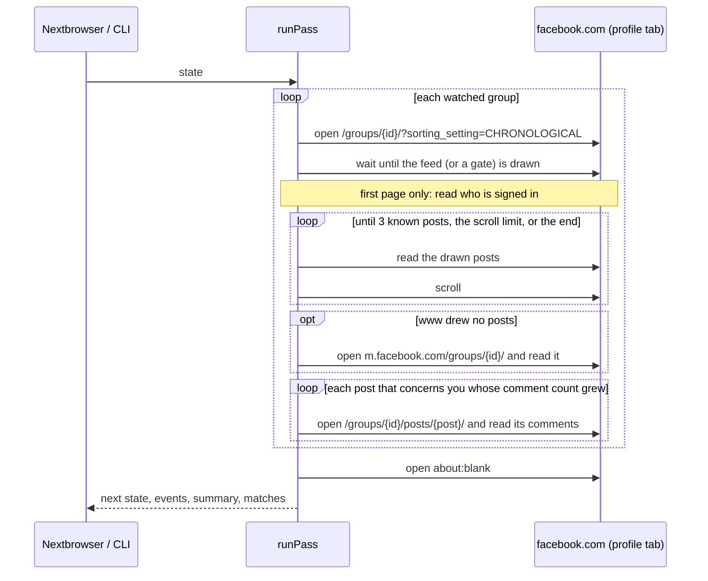

# How it works

A **pass** is one look at the watched Facebook groups through a Nextbrowser profile that is signed in to facebook.com. It takes the saved state in and returns the next state, the events, a summary, and the matches it found. It never changes the state it was given: a pass that is stopped or fails halfway leaves the last saved state intact, and a pass that finishes returns everything it learned. When the next pass runs is up to the caller.

## Reading facebook.com

A group's content is gated: Facebook shows it only to a signed-in member (or, for a public group, to a signed-in account), and the data its own app loads it from is signed per session and changes with every release. So the monitor reads what a member sees: it opens the group page in the profile's tab, waits until Facebook has drawn the feed, and reads the posts out of the page.

Facebook's markup is generated. Class names are random strings that change with every release, and nothing carries a test id. The page scripts ([`src/scripts.ts`](../src/scripts.ts)) therefore lean only on what survives releases because accessibility and links need it:

| What | How it is found |
| --- | --- |
| The feed | `[role="feed"]` |
| A post | a `[role="article"]` or `[aria-posinset]` unit in the feed; comment previews nested in it (`[role="article"]` labelled "Comment by …") are not the post |
| Its id and link | a permalink: `/groups/<g>/posts/<id>/`, `/groups/<g>/permalink/<id>/`, `?multi_permalinks=<id>`, `story_fbid=<id>`. When a post links both an opaque `pfbid…` id and its number, the number is its id and the `pfbid` one an alias — see [one post, two ids](#one-post-two-ids) |
| Its author | the first link in the post's header to a profile: `/groups/<g>/user/<id>/` or `/profile.php?id=<id>` |
| Its text | `[data-ad-preview="message"]` / `[data-ad-comet-preview="message"]`, or the longest `div[dir="auto"]` in the post; emoji drawn as images are read from their `alt` |
| Tags | links to profiles inside the text |
| Counts | "23 comments", "All reactions: 1.2K", "You and 12 others", read like the X monitor reads "1.2K" |
| "See more" | a `[role="button"]` labelled "See more": the post is reported as `truncated`, never expanded |
| Its time | the permalink's own label ("3h", "Yesterday at 10:15") — see below |
| The group's name | the page's `h1`, or the page title |
| Who is signed in | the `c_user` session cookie for the numeric id; the name from a link to that id's profile, or the account button's label |

Every value from outside the page is inserted into a script as a JSON literal, and every read is cut down in the page to the fields the monitor uses. Nothing is clicked, typed or submitted.

### Waiting for the page

The load event fires long before Facebook draws anything. After it, the page is polled every half second, for up to 20 seconds, until a post is drawn or until the page turns out to be one of the screens in front of the group (sign-in, security check, block, not a member, not available), which ends the wait just as well. Then the page's health is read: what it shows, and why.

### Scrolling

The group is opened with `?sorting_setting=CHRONOLOGICAL`, so the newest posts are on top; without it Facebook shows "Most relevant", which reorders old posts above new ones. A read takes what is drawn and scrolls by most of a viewport, up to `maxScrolls` times (3), until it has passed three posts the last pass saw — one would usually do in a chronological feed; three keep a single post drawn out of order from ending the read early. Two scrolls in a row that bring nothing end the read too. A group's first read does not scroll: it announces nothing, so there is nothing to look for further down.

### The m.facebook.com fallback

When www.facebook.com draws no posts for a group — a blank page, its error screen, or "This content isn't available right now" — the pass opens the same group once on `https://m.facebook.com/groups/<id>/`. Where Facebook still serves it, the mobile site is drawn on the server: each post an `<article>` (or a block whose `data-ft` attribute names the post), its time in an `<abbr>`, its permalink a "Full Story" link. It is read without scrolling. When it draws nothing either, the group is noted as unreadable for this pass — not a failed pass: the other groups are read as usual, and the group's starting line and seen posts are kept.

## What counts as new

Facebook never draws a timestamp a script can trust. It draws "3h", "2 hrs", "Yesterday at 10:15" or a date, often with the letters scattered across hidden spans, so text read from the page comes out scrambled. So time is not what decides freshness.

The first time a group is read, what it holds is its **starting line**: the pass records the time and every post id, and announces nothing. From then on a post is new when its id was not seen before (the state keeps the 5,000 most recently seen item keys; a key read again moves to the newest end, so a pinned post or a long-lived thread that stays in view is never trimmed off and announced again) and:

- **it sits above the newest post the last pass saw.** In a chronological feed, anything above a known post came after it. This is the rule that does the work, and it needs no time at all; or
- **its drawn time says it was created after the starting line**, which dates a post the feed position cannot — for instance when the read never got back to a known post.

A drawn time is read as a range, never a point: "3h" means at least three hours and less than four. "Yesterday" is taken as anywhere in the last 48 hours, because the profile's time zone, which Facebook draws in, is often the proxy's rather than the machine's. A date, a scrambled label, or another language gives no range. With a range:

- a post whose latest possible time is before the starting line is never new, wherever it sits: it is pinned, or bumped back into view;
- a post older than `maxItemAgeMs` (72 hours) is not announced.

When a read never gets back to a known post — the group was very busy, or the scroll limit was too low — the summary says so, and only posts with a readable time after the starting line are announced from it. New items are emitted as `new_item` events, oldest first within each group.

A group removed from the settings is forgotten, so adding it back starts over.

### One post, two ids

www.facebook.com often links a post by an opaque `pfbid…` id, while m.facebook.com names it by its number (`story_fbid`, or the `top_level_post_id` in an article's `data-ft`). When a post's links (or its `data-ft`) give both, the number is its id, so both sites agree on it, and the `pfbid` key is kept in `seen` beside it: a later read that finds either id knows the post. A numeric link is only taken from the same group as the post's own permalink, so a post that shares another group's post keeps its own id.

When www.facebook.com draws only the `pfbid` link and a later pass falls back to m.facebook.com, which draws only the number, nothing on either page ties the two together: the post gets a second key, and the fallback read may announce it again. That is a known limit.

## What is reported

A post is reported when it **mentions the account** or **names a keyword**. With `reportAllPosts`, every new post is. With no keywords and `reportAllPosts` off, only mentions and comments on the account's own posts are reported, and the summary says so.

- **A mention** is a tag in the text that links to the account's profile, a tag drawn with the account's name, or the account's full name in plain text. A first name alone is not a mention: it is half the group's.
- **Keywords** are matched as whole words or phrases, case-insensitively, in any script. A hashtag counts as a word: `acme` is found in `#acme`, not in `acmeshop`.
- **Exclusion words** drop an item even when a keyword matched, unless the item mentions the account.
- **The account's own posts** are never reported; their comments are.

Every item carries its group (`id`, `name`, `url`), its post (`id`, `url`, `author`, the text's opening), and a direct link: the post (`https://www.facebook.com/groups/<group>/posts/<id>/`) or the comment (the post's link with `?comment_id=<id>`).

## Comments

Opening a post is a page load of its own, so comments are read sparingly. Only posts that concern the account are watched: its own posts, and posts that mention it or name a keyword. For each, the state keeps the comment count Facebook drew (`state.posts`), and:

- a post seen for the first time is only recorded; its comments are part of the starting line — unless the post itself is new, and then its comments are all new too. A new post is recorded with a count of nothing straight away, before its page is opened, so a pass that is stopped, blocked, or cannot open that page leaves it due for the next pass rather than taking its comments as the starting line;
- after that, a post is opened only when its drawn count grew;
- a pass opens at most `maxCommentReads` posts (5). A post past that keeps its old count, so the next pass sees the growth and opens it — nothing is skipped, only delayed — and the summary says how many wait.

On the post's page the top-level comments are read: `[role="article"]` labelled "Comment by …" (replies, labelled "Reply by …", are left out), their id from the `?comment_id=` in their timestamp link. A comment is reported when it mentions the account, when it is on the account's own post, or when it names a keyword.

### The recorded count moves only by what was read

A post's page draws the comments Facebook picks. A slow load or collapsed comments draw none; Facebook's "Most relevant" order leaves some of the newest out; and Facebook's count takes in replies, which are not read. The monitor never clicks — not the comment order, not "View more comments" — so it cannot ask for the rest. Instead, the count recorded in `state.posts` moves only by the unseen comments the page actually drew:

- a read that draws as many unseen comments as the count grew by records the new count;
- a read that draws fewer records the old count plus what it drew, and is counted as a short read (`shortReads`). The post stays due and is opened again on the next pass;
- after three short reads in a row the count is taken as read, so a post whose missing comments will never be drawn — replies, or comments "Most relevant" keeps hidden — is not opened forever. The summary says so in a note.

So a growth Facebook never draws costs up to three page loads, not one, and a comment "Most relevant" hides through all three reads is not reported.

An unseen comment with a readable time is new when it was written after the starting line. One without a readable time is new only when every unseen comment must be: under a post that is itself new, or when no more comments are unseen than the count grew by. The first opening of an older post also shows comments from before the starting line, and those, undated, cannot be told apart from the new ones.

## Triage

Every match is ranked by fixed rules ([`src/triage.ts`](../src/triage.ts)). Each adds points and a reason in plain words:

| Rule | Points | Reason shown |
| --- | --- | --- |
| Mentions the account | +4 | "Mentions you" |
| A comment on the account's own post | +2 | "On your post" |
| Says an urgent term (`urgentTerms`: "refund", "not working", "can't log in"…), in an item that is addressed to the account or names a keyword | +3 | `Says "can't log in"` |
| Asks a question: a question mark, or text that starts with a question word | +1 | "Asks a question" |
| Asks for a recommendation: "recommend", "looking for", "alternative to", "any suggestions" | +1 | "Asks for a recommendation" |
| A post nobody has commented on yet | +1 | "No comments yet" |
| A post that gained 30 or more comments since the last pass | +1 | "35 comments since the last pass" |

Four points or more is **high**, two or three is **medium**, anything else is **low**. A request for a recommendation is a lead for a brand, not an emergency, so it has its own small rule rather than a place among the urgent terms. No model is involved, and nothing is sent anywhere.

## Degraded states

| What the page shows | What the pass does |
| --- | --- |
| The sign-in wall: `/login`, a login form, or the email and password fields of the dialog over a public group; or, on the first page, no `c_user` session cookie and no account button (a public group drawn to a visitor without its login dialog) | Emits `signed_out` once, sets `loginRequired`, and stops: group content cannot be read signed out. |
| A security check: anything under `/checkpoint/` | Emits `security_check`, sets `securityCheck`, and stops. Someone has to complete it in the profile. |
| A block: "You're Temporarily Blocked", "You can't use this feature right now", "Your account is restricted", the "going too fast" warning — looked for only in Facebook's own chrome (dialogs, banners, headings, the page around the feed), never in a post or a comment that quotes it | Sets `rateLimited` and `blocked` with Facebook's words, and stops. |
| A private group the account has not joined | Notes "You are not a member of …" and goes on with the next group. |
| "This content isn't available right now" on both sites | Notes the group as not available and goes on. |
| No posts drawn on www.facebook.com | Reads the group from m.facebook.com. |
| No posts drawn on either site | Notes the group as unreadable this pass and goes on. |
| A post's page that fails | Logs it and goes on; the post keeps its old count and is opened again next pass. |
| A post's page that draws fewer new comments than the count grew by | Records only what it drew; after three such reads in a row, takes the count as read and says so. |
| Anything else: the browser or the engine throws | Notes "The pass failed: …", sets `failed`, and keeps what was read before. |

After a stop, the caller backs off: `scheduleDelay(interval, { backOff: true })` waits three intervals. A pass that stops keeps everything it read before the stop, and every group it did not reach keeps its old state.

## Pacing

Facebook blocks accounts that load pages like a script, and every read here is a page load. The pass is slow on purpose:

- at least 15 minutes between passes, 30 by default, with a ±20% spread;
- a pause of 4 to 9 seconds before every page after the first, and 1.2 to 3.5 seconds after every scroll;
- at most 10 groups, 6 scrolls per group, 10 posts opened for comments per pass;
- the tab is parked on `about:blank` after the pass (`parkTab`), so nothing is left polling facebook.com between passes.

## What it never does

The engine only reads. It never reacts, comments, replies, joins, posts, or sends a message, and it never clicks — not even "See more". It keeps no network connections, timers, or files of its own: everything goes through the browser and the state it is handed.
