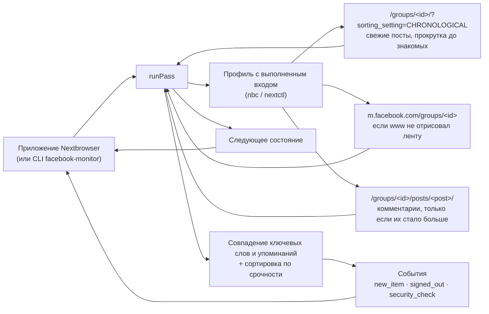

<p align="center">
  
</p>

<h1 align="center">Nextbrowser Facebook Monitoring</h1>

<p align="center">
  <strong>Открытый движок мониторинга групп Facebook для Nextbrowser: посты и комментарии в отслеживаемых группах, где названы ваши ключевые слова или упомянуты вы, — каждый с группой и постом, отсортированные по тому, насколько срочно нужен ответ, — прямо из вашего браузерного профиля, в котором выполнен вход.</strong>
</p>

<p align="center">
  <a href="https://nextbrowser.com/">Сайт</a> ·
  <a href="https://github.com/nextbrowser-oss/nextbrowser-app">Приложение Nextbrowser</a> ·
  <a href="https://docs.nextbrowser.com/">Документация продукта</a> ·
  <a href="../../walkthrough.md">Пошаговый пример</a> ·
  <a href="../../how-it-works.md">Как это работает</a> ·
  <a href="https://discord.com/invite/gHXEvkGXnz">Discord</a>
</p>

<p align="center">
  <a href="https://github.com/nextbrowser-oss/nextbrowser-facebook-monitoring/actions/workflows/ci.yml"></a>
  <a href="../../../LICENSE"></a>
  
  
  <a href="https://github.com/nextbrowser-oss/nextbrowser-app"></a>
</p>

<p align="center">
  <a href="../../../README.md">English</a> ·
  Русский
</p>

<p align="center">
  
</p>

## Зачем нужен Nextbrowser Facebook Monitoring

Этот пакет — движок, на котором работает мониторинг групп Facebook в [Nextbrowser](https://github.com/nextbrowser-oss/nextbrowser-app). Важные разговоры о продукте часто идут в группах Facebook — группах пользователей, кругах основателей, местных барахолках, — а содержимое группы закрыто: его показывают только участнику, который вошёл в аккаунт, и ни обычный API, ни поисковик его не прочитают. Движок работает в браузерном профиле, где вы вошли в facebook.com как участник этих групп, и за каждый проход отвечает на три вопроса:

- в каких новых постах отслеживаемых групп названы ваши ключевые слова — бренд, продукт, конкурент;
- кто упомянул вас и кто прокомментировал ваши посты или посты, которые вас касаются;
- на что из этого нужно ответить в первую очередь.

Код открыт, потому что движок работает с вашим собственным аккаунтом. Любой может прочитать, какие именно страницы он открывает, что с них читает и как решает, что срочно.

- **Только чтение.** Он никогда не ставит реакции, не комментирует, не отвечает, не вступает в группы и не публикует. Он даже не нажимает «See more»: обрезанный пост так и помечается как обрезанный.
- **Контекст в каждом оповещении.** У каждого элемента есть группа (id, название, ссылка), пост (id, ссылка, автор, начало текста), а у комментария — пост, под которым он написан.
- **Без повторных оповещений.** Каждый пост и комментарий запоминается по id, поэтому о нём сообщается один раз — и после перезапуска тоже.
- **Объяснимая сортировка.** Фиксированные правила ставят каждому совпадению уровень *high*, *medium* или *low*, и к каждому прилагаются причины обычными словами. Никакой модели, и ничего не уходит с машины.
- **Говорит, что пошло не так.** Профиль без входа, проверка безопасности, временная блокировка, группа, в которой вы не состоите, и страница, которую Facebook не отрисовал, сообщаются как есть, а не как «ничего нового».

## От поста до одобренного ответа

Мониторинг — это половина Facebook-скилла в Nextbrowser. Панель скилла переключается между **Monitoring** и **Reply agent**:

| Шаг | Где | Что происходит |
| --- | --- | --- |
| 1. Поиск упоминаний и контента | этот движок | Свежие посты каждой отслеживаемой группы, сначала новые, вниз до места, где остановился прошлый проход: посты, где названы ваши ключевые слова или упомянуты вы, и комментарии под вашими постами и под постами, которые вас касаются. |
| 2. Сортировка по срочности | этот движок | Каждое совпадение получает ранг: упоминает вас, написано под вашим постом, содержит срочное слово вроде «refund» или «not working», задаёт вопрос, просит совета, ещё без комментариев, быстро набирает обороты. |
| 3. Черновик ответа | Facebook reply agent в Nextbrowser | *Draft reply* передаёт совпадение — вместе с группой и постом — подключённому агенту, который открывает пост в том же профиле, читает обсуждение и пишет ответ именно на этот пост или комментарий. |
| 4. Одобрение перед публикацией | Facebook reply agent в Nextbrowser | Черновик сначала показывается вам. Ничего не публикуется, пока вы не одобрите, и тогда — только этот ответ. |

Движок намеренно останавливается на шаге 2: что бы он ни нашёл, что сказать в ответ, решает человек. [Пошаговый пример](../../walkthrough.md) проводит один пост из группы через все четыре шага.

## Основные возможности

| Область | Что доступно |
| --- | --- |
| Отслеживаемые группы | До 10 групп — по ссылке, id или короткому имени. Каждая читается в хронологическом порядке (`?sorting_setting=CHRONOLOGICAL`), сначала новые, с несколькими прокрутками, пока не дойдёт до постов, которые видел прошлый проход. |
| Ключевые слова | До 20 слов или фраз, как целые слова в любом алфавите. Хештег считается словом. Слова-исключения отсекают шум. Без ключевых слов сообщается только об упоминаниях и комментариях под вашими постами — или о каждом новом посте, если включён `reportAllPosts`. |
| Упоминания | Отметка со ссылкой на профиль аккаунта или полное имя аккаунта в тексте. |
| Комментарии | Под вашими постами и под постами, где названо ключевое слово или упомянуты вы, — только если число комментариев выросло, и не больше нескольких постов за проход. |
| Сортировка по срочности | *high*, *medium* или *low* с причинами — по правилам, которые можно прочитать в [`src/triage.ts`](../../../src/triage.ts). Срочные слова учитываются только в том, что касается вас; просьба посоветовать — это лид, а не пожар. |
| Ссылки и контекст | Каждый элемент ведёт прямо на пост (`/groups/<group>/posts/<id>/`) или комментарий (`?comment_id=<id>`) и несёт группу и пост, к которым относится. |
| Запасной путь | Если www.facebook.com не отрисовал ленту, группа читается ещё раз с более простой страницы m.facebook.com, которую рисует сервер. |
| Сохранение состояния | Один JSON-документ: стартовая линия каждой группы, увиденные элементы, число комментариев по постам, аккаунт. После перезапуска ничего не сообщается дважды. |
| Нештатные состояния | Нет входа, проверка безопасности, временная блокировка, вы не участник группы, группа недоступна, ни один из сайтов ничего не отрисовал — у каждого состояния понятная заметка и флаг в сводке. |
| Встраиваемое ядро | `runPass(state) → { state, events, summary, matches }` без зависимости от Node, поэтому работает в рендерере Nextbrowser. |
| Отдельный CLI | `facebook-monitor` управляет любым профилем Nextbrowser через `nbc`/`nextctl`. |

## Настройка

### В Nextbrowser

1. Откройте **Skills → Facebook → Monitoring**.
2. Выберите браузерный профиль и нажмите **Open facebook.com**. Войдите там сами — аккаунтом, который состоит в нужных группах; панель покажет `Dana Reyes · Signed in`.
3. Вставьте ссылки на группы (до 10), добавьте ключевые слова (бренд, названия продуктов, частые опечатки) и слова, которые нужно пропускать.
4. Выберите интервал — по умолчанию 30 минут, минимум 15 — и нажмите **Start**.

Первый проход проводит стартовую линию каждой группы и ни о чём не сообщает; со второго прохода панель показывает, что требует внимания, — сначала самое срочное, с группой и постом рядом с каждым совпадением и кнопкой *Draft reply* у каждого.

Используйте профиль со своим стабильным прокси и аккаунт, который уже пользуется этими группами как человек. Facebook блокирует аккаунты, которые грузят страницы как скрипт; оставьте темп как есть.

### В коде

Nextbrowser поставляет движок как зависимость и даёт ему браузер, место для хранения состояния и таймер:

```ts
import { normalizeState, runPass, scheduleDelay, withSettings } from "@nextbrowser-oss/facebook-monitoring";

const saved = withSettings(normalizeState(await load()), {
  groups: ["https://www.facebook.com/groups/acme.users/"],
  keywords: ["acme"],
});
const { state, events, summary, matches } = await runPass({
  browser: cliBrowser(profileArgs),          // the app's nextctl-backed browser for the profile
  state: saved,
  onEvent: (event) => notify(event),         // new_item, signed_out, security_check, ...
});
await save(state);
show(matches);                               // most urgent first, with the reasons and the group
const backOff = !!summary.blocked || summary.rateLimited || summary.securityCheck || summary.loginRequired;
setTimeout(next, scheduleDelay(30 * 60_000, { backOff }));
```

Контракт между приложением и движком описан в [руководстве по интеграции](../../integration.md).

### Отдельно

Нужны Node.js 22 или новее и профиль Nextbrowser, в котором выполнен вход в facebook.com аккаунтом-участником групп. CLI использует бинарник `nextctl`, которым управляет приложение, или `nbc` из `PATH`.

```bash
git clone https://github.com/nextbrowser-oss/nextbrowser-facebook-monitoring.git
cd nextbrowser-facebook-monitoring
npm ci
npm run build
node dist/node/bin.js run --profile <your-profile> --groups <group-link-1>,<group-link-2> --keywords "<brand>,<product name>"
```

Чего ожидать:

1. Первый проход записывает свежие посты каждой группы как её стартовую линию и ни о чём не сообщает.
2. Каждый следующий проход печатает новые совпадения — самые срочные с пометкой `HIGH`, с группой, причинами и прямой ссылкой, — и ждёт около тридцати минут (`--interval`).
3. Остановите его <kbd>Ctrl</kbd>+<kbd>C</kbd>. Следующий запуск продолжит с сохранённого состояния в `~/.nextbrowser/facebook-monitoring/<profile>.json`.

Если направить вывод в другую программу, он переключается на JSON Lines — одно событие на строку. Все флаги перечислены в [справочнике CLI](../../cli-reference.md).

## Конфигурация

| Настройка | По умолчанию | Значение |
| --- | --- | --- |
| `groups` | `[]` | До 10 групп: ссылки, id или короткие имена. |
| `keywords` | `[]` | До 20 слов или фраз. |
| `excludeKeywords` | `[]` | Слова, которые отбрасывают элемент, даже если ключевое слово совпало. |
| `urgentTerms` | встроенный список | Слова, которые делают элемент срочным. |
| `reportAllPosts` | `false` | Сообщать о каждом новом посте в группах, а не только о тех, где названо ключевое слово или упомянуты вы. |
| `watchComments` | `true` | Читать комментарии под вашими постами и под постами, которые вас касаются, если их число выросло. |
| `maxScrolls` | `3` | Прокруток на группу, чтобы дойти до постов, которые видел прошлый проход (0–6). |
| `maxCommentReads` | `5` | Сколько постов один проход может открыть ради комментариев (0–10); остальные ждут следующего прохода. |
| `maxItemAgeMs` | 72 ч | О более старых элементах не сообщается. |
| `parkTab` | `true` | Оставлять вкладку на `about:blank` после прохода. |

Все настройки, события и поля документа состояния описаны в разделе [«События и состояние»](../../events-and-state.md).

## Как это работает



Каждый проход по очереди для каждой отслеживаемой группы: открывает хронологическую ленту группы, ждёт, пока Facebook её отрисует, и читает, кто вошёл; читает посты по ролям, aria-атрибутам и форме ссылок на странице, прокручивая назад до постов, которые видел раньше; переходит на m.facebook.com, если ничего не отрисовано; решает, что ново, по id поста и его месту в ленте; открывает посты, комментарии которых пора прочитать; а в конце паркует вкладку. Каждое правило описано на странице [«Как это работает»](../../how-it-works.md).

## Документация

- [Пошаговый пример](../../walkthrough.md): один пост из группы от обнаружения до одобренного ответа.
- [Как это работает](../../how-it-works.md): проход, чтение страницы, новизна без меток времени, комментарии, сортировка, запасной путь, нештатные состояния, темп.
- [Руководство по интеграции](../../integration.md): контракт с приложением Nextbrowser, Node-адаптер, установка пакета.
- [События и состояние](../../events-and-state.md): все события, документ состояния и настройки.
- [Справочник CLI](../../cli-reference.md): команды, флаги, вывод и коды выхода `facebook-monitor`.
- [Решение проблем](../../troubleshooting.md): нет входа, проверки безопасности, временные блокировки, вы не участник, группы, которые не отрисовываются, пропущенные посты и комментарии.

## Статус проекта

Это ранний выпуск (`0.x`). Известные ограничения:

- **Ещё не проверен вживую.** Ничего из этого не запускалось на живой сессии Facebook с выполненным входом. Скрипты страниц проверены тестами на урезанных документах, повторяющих структуру, которую, как известно, рисует Facebook, и первый живой запуск, скорее всего, потребует исправлений.
- **Разметка Facebook обфусцирована и часто меняется.** Имена классов генерируются и меняются с каждым релизом, поэтому скрипты их никогда не используют: они опираются на роли (`[role="feed"]`, `[role="article"]`), aria-атрибуты, атрибуты, которые Facebook ставит для своих нужд (`data-ad-preview="message"`, `dir="auto"`), и форму ссылок (постоянные ссылки, профили, `comment_id`). Когда Facebook меняет и это, чтение возвращается пустым, и проход говорит об этом, а не молчит.
- **Нарисованному времени не доверяем.** Facebook рисует время как «3h» или «Yesterday», часто перемешивая буквы по скрытым элементам. Новизну поста решают его id и место в хронологической ленте; читаемое время — лишь граница.
- **Лучше английский интерфейс.** Экраны входа, проверки безопасности, блокировки и «вы не участник», а также подпись «Comment by» у комментариев распознаются по английским формулировкам. Посты читаются на любом языке; на других языках эти состояния определяются менее точно.
- **Комментарии — как их показывают.** Страница поста показывает подборку комментариев («Most relevant»), не обязательно все новые, и монитор никогда не кликает, чтобы это изменить; ответы на комментарии не читаются. Записанное число комментариев сдвигается только на то, что чтение показало, поэтому пост открывается повторно до трёх раз, прежде чем недостающие комментарии считаются прочитанными.
- **Один пост, два id.** www.facebook.com может ссылаться на пост по id вида `pfbid…`, а m.facebook.com — по его номеру. Когда пост ссылается на оба, они связываются; когда нет, чтение через запасной путь может объявить пост повторно.
- **Запасной путь через m.facebook.com тоже может ничего не показать.** Facebook всё реже отдаёт мобильный сайт, отрисованный на сервере; если вместо него приходит оболочка приложения, группа отмечается как непрочитанная в этом проходе.

Предложения и баги — в [GitHub Issues](https://github.com/nextbrowser-oss/nextbrowser-facebook-monitoring/issues). Issue — это предложение, а не обязательство выпустить.

## Участие в разработке

Прочитайте [CONTRIBUTING.md](../../../CONTRIBUTING.md), прежде чем открывать изменение. Держите изменения сфокусированными. Любое изменение того, что читается с facebook.com, или того, как ранжируется совпадение, должно сопровождаться тестами. Изменение README должно обновлять и [русскую версию](README.md).

## Сообщество и поддержка

- Присоединяйтесь к [Discord Nextbrowser](https://discord.com/invite/gHXEvkGXnz): общение, помощь с настройкой и новости продукта.
- Общие вопросы задавайте в [Nextbrowser Discussions](https://github.com/nextbrowser-oss/nextbrowser-app/discussions).
- [GitHub Issues](https://github.com/nextbrowser-oss/nextbrowser-facebook-monitoring/issues) — для конкретной, ограниченной по объёму работы.
- Об уязвимостях сообщайте приватно по [SECURITY.md](../../../SECURITY.md). Не публикуйте детали уязвимостей в issue.

## Ответственное использование

Отслеживайте только группы, в которых состоит ваш аккаунт и которые вам разрешено отслеживать, — группы, которыми вы управляете, или группы, чьи администраторы и правила это допускают. Соблюдайте [Условия использования Facebook](https://www.facebook.com/terms.php), его [Условия автоматизированного сбора данных](https://www.facebook.com/apps/site_scraping_tos_terms.php) и правила каждой группы: чтение через собственный браузерный профиль — всё равно автоматизированный доступ, и убедиться, что у вас есть на него право, — ваша задача. Используйте прочитанное только для того, чтобы отвечать людям; не копируйте посты и профили участников куда-либо ещё.

Монитор намеренно соблюдает темп:

- не меньше пятнадцати минут между проходами, тридцать по умолчанию, и три интервала после выхода из аккаунта, проверки безопасности или блокировки;
- пауза от четырёх до девяти секунд перед каждой страницей и несколько секунд между прокрутками;
- не больше 10 групп, 6 прокруток на группу и 10 постов, открытых ради комментариев, за проход;
- между проходами вкладка паркуется на `about:blank`.

Не снимайте эти ограничения ради массового сбора данных. Не используйте найденное для непрошеных или однотипных ответов: администраторы групп за это удаляют участников, а Facebook ограничивает аккаунты.

## Лицензия

Nextbrowser Facebook Monitoring — открытое программное обеспечение под лицензией [GNU Affero General Public License v3.0 only](../../../LICENSE).

AGPL-3.0 разрешает коммерческое использование, изменение и распространение. Если вы распространяете изменённую версию или запускаете её как сетевой сервис, лицензия требует предоставить соответствующий исходный код на тех же условиях. Зависимости этого репозитория остаются под своими лицензиями.

Copyright © 2026 Nextbrowser contributors.
